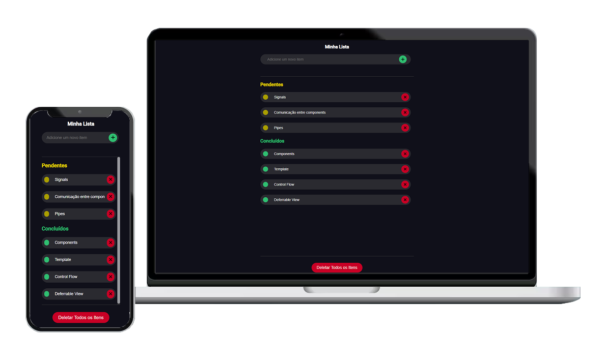

## Sobre o Angular Lista De Tarefas

A Lista de Tarefas trata-se de um programa desenvolvido para consolidar estudo/conhecimento em um projeto prático com o framework front-end, Angular.

Inicialmente, o programa possibilita criar uma lista de itens, tarefas que são gerenciados pelo usuário. Dessa forma, o usuário poderá 'cadastrar', 'editar' e 'excluir' seus dados. Além disso, poderá atualizar os status dos registros para 'pendentes' e 'concluídos'.

Destaca-se, que o layout foi desenvolvido para ser possível a navegação em dispositivos Desktops, tela de computadores, e Mobile, tela de celulares. Consequentemente, é importante frizar que os códigos de estilização, SCSS, foram elaborados do zero. Com isso, garante-se uma navegação rápida e com melhor experiência do usuário. 

### Tela da Página
- Lista de Tarefas [IMG](src/assets/img/lista-de-tarefas-angular.png)

## Tecnologias utilizadas

### Angular
- **[Angular CLI Versão 17.3.8.](https://github.com/angular/angular-cli)**

## Construção do Ambiente Local

Para configurar o ambiente local do Sistema, é essecial seguir o passa a passo abaixo:

    1. Faça o clone do projeto via git;
    2. Usando o cmd ou terminal, vá até a pasta do onde clonou o projeto;
    3. Execute 'composer install';
    4. Execute o comando 'ng serve';

## Licença

A Lista de Terefas foi desenvolvido em Angular e utiliza a licença MIT.
